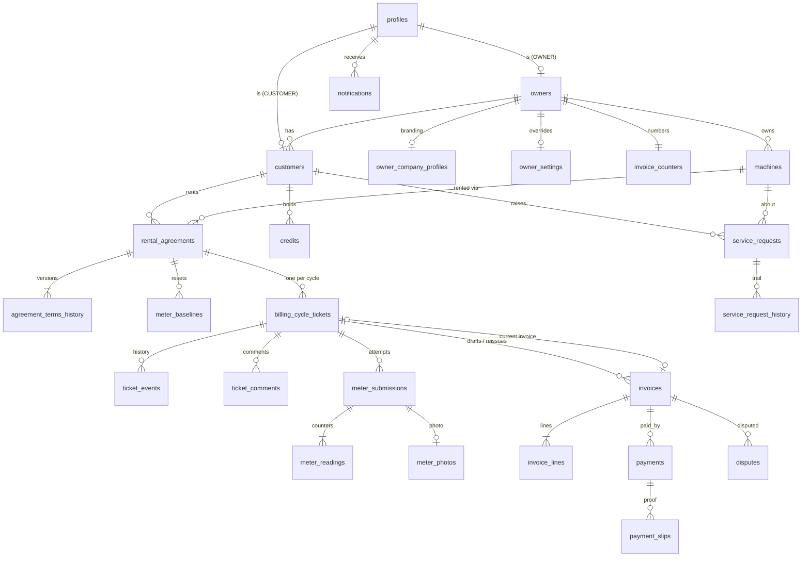

# RentDesk — Database

Supabase Postgres, one shared schema (`public`) for all tenants. Every tenant table has `owner_id`
and row-level security (RLS). Migrations live in `supabase/migrations/` (`0001`–`0021`). Types are
generated into `src/types/db.ts` with `npm run db:types`. The private `app` schema holds RLS helpers
and workflow functions. It is **not** exposed through the Data API.

## Conventions

- **Tenancy.** `owner_id → owners(id)` on every tenant table, plus composite foreign keys
  `(child_id, owner_id) → parent(id, owner_id)`. A row can never reference another tenant's row,
  even when written with the service role.
- **Identity.** `auth.users` holds credentials. The login email is synthetic:
  `{username}@users.rentdesk.invalid`. `profiles.id`, `owners.id` and `customers.id` are all the
  auth user id. Real contact emails live in `owners` and `customers`.
- **Money** is `bigint` cents. **Timestamps** are `timestamptz`. Deadlines are computed in
  `Asia/Colombo` by server code and passed in.
- **Errors** raised by the workflow functions use these SQLSTATE codes:
  - `RD400`: invalid input
  - `RD403`: actor not allowed
  - `RD404`: not found
  - `RD409`: stale state or conflict

## Tables

| Area | Table | Purpose |
| --- | --- | --- |
| Accounts | `profiles` | Role (`ADMIN`/`OWNER`/`CUSTOMER`), tenant, status, `must_change_password`, login security |
| | `owners` | Tenant business details, plan |
| | `owner_company_profiles` | Branding (spec 17): company, logo, bank details, letterhead + layout, `onboarding_completed_at` |
| | `customers` | Customer details (status lives in `profiles`) |
| | `subscription_plans` | Optional plans (ADM-07) |
| Settings | `platform_settings` | Global defaults (single row): stage deadlines, reminders, grace period, late fee, login lockout and session timeout |
| | `owner_settings` | Per-owner overrides (null = inherit); view `owner_settings_effective` merges them |
| Fleet | `machines` | Brand, model, serial, `MONO`/`COLOUR`, status, counter maximum (rollover) |
| | `rental_agreements` | Current terms, installation, initial/closing readings, `first_billing_date`, cycle calendar (`next_cycle_no/date`), `billing_day` (the first billing date's day of the month; cycles are monthly), late fee setting, return idempotency key |
| | `agreement_terms_history` | Every version of the pricing terms (commitment, included copies, rates, due days, late fee setting), who changed it, when, and the cycle it applies from. Append-only |
| | `meter_baselines` | New baseline after a meter reset or replacement |
| Billing cycle | `billing_cycle_tickets` | One per agreement per cycle (unique `(agreement_id, cycle_no)`); terms snapshot; stage clock (`stage_entered_at`, `stage_due_at`, `reminder_count`, `escalation_level`, `paused_at`) |
| | `ticket_events` | Every transition: actor, from, to, reason |
| | `ticket_comments` | Customer/owner comments |
| | `meter_submissions` | Each reading attempt (idempotency key, server timestamp, review outcome) |
| | `meter_readings` | Per-counter previous/current values, kept permanently |
| | `meter_photos` | Temporary photo record; the file is deleted on confirm, the row stays |
| | `invoices` / `invoice_lines` | Draft → issued invoice; number assigned on issue; branding snapshot |
| | `invoice_counters` | Per-owner, gap-free invoice sequence |
| Payments | `payments` | Customer slips and owner-recorded cash/cheque; duplicate flag |
| | `payment_slips` | File path, SHA-256, MIME type, size, retention |
| | `disputes` | Invoice disputes |
| | `credits` | Overpayments, credits from cancelled invoices, advances (with agreement, date received, method, reference). CREDIT invoice lines point at the credit they use (`invoice_lines.credit_id`) |
| | `deposit_transactions` | Security deposit ledger per agreement: received, deducted (paid an invoice), refunded, retained. Append-only, never below zero |
| Service | `service_requests` / `service_request_history` | Requests and their status trail (trigger-written) |
| Cross-cutting | `notifications` | In-app centre and email/SMS outbox (delivery status) |
| | `notification_templates` | Global (`owner_id` null) and per-owner templates |
| | `idempotency_keys` | Request de-duplication for server actions |
| | `login_attempts` | Rate limiting / lockout input |
| | `audit_logs` | Append-only audit trail, written by triggers and `app.write_audit()` |
| | `cron_runs` | One row per run of the daily job: trigger, the "now" used (simulated outside production), status, counts, errors, work remaining |
| Views | `customer_balances` | Outstanding amount per customer: issued, unpaid invoices minus `amount_paid_cents` (security invoker, so RLS applies). Credits are not netted yet |
| | `agreement_deposit_balances` | Deposit received / deducted / refunded / retained / held per agreement (security invoker) |

## Who can do what

The database enforces this table. RLS policies use only four helpers in the private `app` schema:
`current_user_role()`, `current_owner_id()`, `current_customer_id()` and `is_admin()`. They are
`SECURITY DEFINER`, `STABLE`, and use `search_path = ''`. They return NULL unless the caller is
`ACTIVE` and, for a customer, their owner is `ACTIVE` too. Suspended or deactivated users, and
customers of a suspended owner, therefore match no policy and see nothing.

| Data | ADMIN | OWNER (own tenant) | CUSTOMER (own records) | anon |
| --- | --- | --- | --- | --- |
| profiles, customers | read all | read; update customer contact columns | read self | — |
| owners | read all | read self | read own owner | — |
| company profile / branding | read all | read, insert, update | read (own owner) | — |
| settings | read all; update global | read, insert, update own | — | — |
| machines | read all | read, insert, update details (not status, not type) | read those they rent | — |
| agreements | read all | read | read their own | — |
| agreement terms history | read all | read | — | — |
| customer balances (view) | read all | read | read own | — |
| meter baselines | read all | read, insert | — | — |
| tickets, events, comments, submissions, readings | read all | read | read own | — |
| meter photos (rows and files) | rows only | read | — | — |
| invoices, lines | read all | read | read own, **not DRAFT/REJECTED** | — |
| payments, slips, disputes, credits | read all | read | read own | — |
| deposit transactions, deposit balances (view) | read all | read | read own | — |
| service requests + history | read all | read | read own | — |
| notifications | read all | read tenant delivery log | read own; set `read_at` | — |
| templates | read all; manage global | read global + own; manage own | — | — |
| audit logs | read all | read own tenant | — | — |
| cron runs | read all | — | — | — |
| login_attempts, idempotency_keys | — | — | — | — |

**Server-write-only.** Clients have no write grants on these tables. Writes come only from server code
using the service role:

- `profiles`, `owners`, inserts into `customers`
- `rental_agreements`, `agreement_terms_history` and `machines.status` (migration 0014)
- tickets, events and comments
- meter submissions, readings and photos
- invoices, invoice lines and invoice counters
- payments, payment slips, disputes and credits
- deposit transactions (append-only even for the service role)
- service requests and their history
- inserts into `notifications`
- `idempotency_keys`, `login_attempts`, `audit_logs` and `cron_runs`

Customers write only through server actions. Clients have no DELETE grants except on an owner's own
notification templates. `audit_logs` is append-only even for the service role.

### Atomic workflow functions (`app` schema, called through `public.rpc_*`)

Server code (`src/lib/tickets`) validates the request and the actor's role. It then calls the
matching `public.rpc_<name>` wrapper with the service-role client, for example
`admin.rpc("rpc_confirm_meter_submission", …)`. Each wrapper only forwards to `app.<name>`.

- **Wrappers:** only `service_role` can execute them. Anon and authenticated get `42501`.
- **Default privileges:** in `public` they are revoked, so a new function is never callable by anon
  or authenticated unless granted explicitly.

Each function:

1. locks the ticket with `SELECT … FOR UPDATE`,
2. re-checks the current status and the actor,
3. writes every affected table in one transaction.

A concurrent second request waits for the lock and then fails with `RD409`.

| Function | Effect |
| --- | --- |
| `open_billing_cycle` | Creates ticket + event + notifications at the job's `p_now`; snapshots terms, late fee and the real days of the cycle; advances the monthly calendar; flags an earlier ticket still waiting for its reading as Overdue (11.6, owner notified); replays safely |
| `submit_meter_reading` | Submission + readings + photo row + draft invoice/lines → `PENDING_OWNER_REVIEW` (idempotent). Closes the older meter-stage tickets of the cycles it bills ("Billed in the cycle N invoice", rule 25); refused (`PREVIOUS_REVIEW_PENDING`) while an older reading waits for review, and a customer reading after the rejection limit (`TOO_MANY_REJECTIONS`, rule 28) |
| `confirm_meter_submission` | Assigns the invoice number, issues the invoice, marks the photo for deletion → `AWAITING_PAYMENT`. `p_submission_id` null = the ticket's estimated draft. Returns `photo_paths` and `photo_ids`: server code deletes the files at once and marks the rows |
| `correct_meter_reading` | INV-08 (rule 29): owner only, reading waiting for review, note required. The engine's recalculated draft is checked (`verify_meter_invoice`, `verify_invoice_credits`, same removed credits); the customer's value is kept in `corrected_from_value`; lines and totals replaced; `CORRECTION` event, audit `METER_READING_CORRECTED`, customer notified |
| `reject_meter_submission` | Reason required; draft → `REJECTED`; → `METER_REQUESTED`. `p_submission_id` null = reject the estimated draft (no second estimate for that ticket) |
| `submit_payment` | Payment + slip, duplicate flag → `PAYMENT_SUBMITTED` (idempotent) |
| `verify_payment` | Accept → `CLOSED`, or partial → `PARTIALLY_PAID`, or reject (reason). An overpayment becomes a credit |
| `transition_ticket` | Cancel (reason; supersedes a pending reading, ends an open dispute), reopen (reason), back to payment, clear an overdue payment (reason + `p_due_date`); the invoice follows. Disputes use their own functions |
| `raise_dispute` / `resolve_dispute` | Customer disputes an issued invoice (reason) → `DISPUTED`; owner rejects or resolves it (explanation) → `AWAITING_PAYMENT` (invoice partially paid if part was paid) |
| `create_estimated_invoice` | Daily job (rule 22): after the meter deadline, when the owner bills estimates, a draft estimated invoice from the engine (`verify_estimated_invoice`, credits checked) → `PENDING_OWNER_REVIEW`; once per ticket |
| `mark_ticket_overdue`, `record_ticket_reminder`, `escalate_ticket`, `apply_late_fee`, `set_ticket_pause` | Daily job steps (rules 20-24). Compare-and-set under the ticket lock: a step already done returns `{skipped}`. `apply_late_fee` re-checks the amount (ticket snapshot → owner → platform), the grace period, once only, never with a slip waiting or a dispute |
| `cron_begin_run` / `cron_finish_run`, `cron_context`, `cron_due_agreements`, `cron_ticket_candidates`, `cron_pause_candidates`, `cron_expired_photos`, `mark_photos_deleted`, `cron_orphan_photos`, `cron_overdue_summaries`, `notify_once` | The daily job's run record (10-minute lease), its reads (keyset pages) and the photo / weekly-summary steps |
| `assign_invoice_number` | Per-owner counter row lock. Rolls back with the transaction, so numbering is gap-free |
| `provision_account` | Profile + owner/customer rows; enforces Admin → Owner → Customer |
| `write_audit` | Explicit audit entries (logins, resets) |
| `login_gate_state` | Lock state, recent failures for the username and for the IP, and the thresholds, in one call |
| `record_login_attempt` | Records an attempt under a profile row lock. A wrong password counts; at the threshold `locked_until` is set (audit `LOCKOUT`). Success clears the lock and sets `last_login_at` (audit `LOGIN`). Failures write `LOGIN_FAILED` |
| `session_state` | Role, status, owner status, `must_change_password`, onboarding and session timeouts for the route guard |
| `set_account_status` | Admin → owner, owner → own customer only. Reason required (stored in the audit entry). In-app notification to the user |
| `reset_account_password` | Same parent rule. Sets `must_change_password`, clears the lockout, audit `PASSWORD_RESET`. Call it **before** setting the new password through the Auth Admin API: it is the permission check |
| `complete_password_change` | Clears `must_change_password` (audit `PASSWORD_CHANGED`) |
| `update_owner` / `update_customer` | Account details with the same parent rule |
| `save_company_profile` | Owner only. Upserts branding; the first save sets `onboarding_completed_at` (BRD-01) |
| `assign_machine` | Owner of both the machine and the customer (another tenant's customer is "not found"). Machine `AVAILABLE`, customer `ACTIVE`, first billing date ≥ today (passed in) and after the start date, colour terms only for colour machines, whole non-negative readings. Creates the agreement (terms version 1 by trigger), machine → `RENTED`, `next_cycle_no = 1`, `next_cycle_date = first_billing_date`, audit `MACHINE_ASSIGNED`, customer notified |
| `return_machine` | Reason and closing reading(s) required; lower than the last known reading only on a counter with a maximum (rollover). `RD409 RETURN_BLOCKED:[…]` only while a meter reading waits for review (unpaid invoices do not block, RET-01). Issues the final invoice built by the billing engine (`app.final_cycle` facts, `app.verify_final_invoice`; closing readings stored as a confirmed owner reading), cancels open meter requests billed in it, settles the deposit or keeps holding it, agreement → `TERMINATED`, machine → `AVAILABLE`, audit `MACHINE_RETURNED`. Replays a retried request (`return_idempotency_key`) |
| `reassign_machine` | `return_machine` (same rules) + `assign_machine` in one transaction |
| `update_agreement_terms` | New terms version from the cycle after the one in progress (`app.cycle_in_progress + 1`); installation location and end date change at once; customer notified |
| `set_machine_status` | `AVAILABLE` / `UNDER_REPAIR` / `RETIRED` with a reason (audit). Never `RENTED`, never while rented |
| `settle_deposit` | Returned agreement only (settle later, DEP-04). Same rules as at return (`apply_deposit_settlement`): deduct + refund + retain = held; deductions pay the agreement's unpaid invoices (no slip waiting, not disputed) oldest due first as accepted payments of method `SECURITY_DEPOSIT`, closing paid tickets; refund needs date and method; retain needs a reason. Audit `DEPOSIT_SETTLED`, customer notified |
| `set_invoice_credit` | Rule 13: the owner removes a credit from a draft (or adds it back). Takes the engine's recalculation, checks only the customer-credit lines changed, swaps them; audit `INVOICE_CREDIT_REMOVED` / `RESTORED` |

Audit triggers record the actor:

- For a signed-in user, the actor is `auth.uid()`.
- For the service role, it is the `app.actor_id` set by these functions, or the `x-actor-id` request
  header. Both are honoured only when the JWT role is `service_role`.

> Keep `app` out of **Project Settings → Data API → Exposed schemas**. Only `public` and
> `graphql_public` are exposed. To make a new workflow function callable by server code, add a
> `public.rpc_*` wrapper and grant it to `service_role` only. `rls.db.test.ts` fails if any callable
> function in `public` is executable by anon or authenticated.

## Login security and sessions (migration 0013)

- **Lockout (AUTH-08).** Wrong passwords for a username are counted since the later of
  its last successful login and the start of the lockout window. After
  `login_max_failures` (5) the account is locked for `login_lockout_minutes` (15).
  Unknown usernames are treated the same way, so a lockout never reveals whether an
  account exists. One IP may fail `login_ip_max_failures` (30) times per
  `login_ip_window_minutes` (15). The pure decision is `src/lib/auth/login-gate.ts`.
- **Sessions (AUTH-09).** Supabase's own session limits are paid features, so the
  proxy (`src/proxy.ts`) signs users out after `session_idle_minutes` (30) without a
  request and `session_max_hours` (12) after signing in (from the JWT `amr` time).
- **Server Actions.** The proxy never redirects a Server Action request (POST with
  `Next-Action`): the browser would follow the 307 with the same POST and React throws
  "An unexpected response was received from the server". It signs the user out if
  needed, lets the request through and names the target page in the internal
  `x-rentdesk-redirect` request header (a client-sent copy is dropped). `currentActor()`
  then calls `redirect()` to it, so an expired, blocked or gated session lands on the
  right page (e.g. `/login?reason=idle`).
- **Blocked accounts (AUTH-10).** The proxy reads `session_state` on every page
  request and signs out suspended or deactivated users and customers of an inactive
  owner, with a message on `/login`. The RLS helpers already return nothing for them.
- **Audit (AUTH-11).** `LOGIN`, `LOGIN_FAILED`, `LOCKOUT`, `LOGOUT`, `PASSWORD_RESET`,
  `PASSWORD_CHANGED` and `STATUS_CHANGE` (with the reason) are written to `audit_logs`.
- All thresholds are columns of `platform_settings`; the admin may change them.

### Custom Access Token hook

`public.custom_access_token_hook(event jsonb)` runs inside Supabase Auth before any
token is issued, so the rules above also hold when someone calls Supabase Auth
directly with the public anon key (bypassing the app). It refuses a token with
`403 RD_BLOCKED:<REASON>` when:

- the user has no profile, is `SUSPENDED` or `DEACTIVATED`, or is a customer whose
  owner is not `ACTIVE` (password sign-in **and** token refresh);
- the account is locked (`locked_until` in the future), for password sign-in only, so
  someone else's wrong guesses cannot sign the real user out.

Only `supabase_auth_admin` may execute it. The app works the same with or without it;
the login page shows the same clear messages either way.

**Enable it (once per project):**

1. Open the Supabase dashboard for the project and go to **Authentication → Hooks**
   (under *Configuration*).
2. Click **Add a new hook** and choose **Customize Access Token (JWT) Claims hook**.
3. Hook type: **Postgres**. Schema: **public**. Function: **custom_access_token_hook**.
4. Make sure **Enable Customize Access Token (JWT) Claims hook** is switched on, then
   click **Create hook**.
5. Check: sign in as `owner.lanka` (works). As admin, suspend a test owner and try to
   sign in as that owner: the login page says the account is suspended.

To turn it off, disable or delete the hook on the same page; nothing else changes.

### Supabase Auth rate limits

Sign-ins go through the app's server, so Supabase Auth sees the server's IP for every
user. Before production, raise **Authentication → Rate Limits → Sign-ups and
sign-ins** well above the default (for example to a few hundred per 5 minutes); the
app's own per-account and per-IP limits above protect logins instead.

## Machines and agreements (migration 0014)

- **Cycle calendar (monthly since 0017).** Cycle *n* is due on `first_billing_date + (n − 1) months`, on the same
  day of the month (the last day of shorter months, then back to the original day: no drift). It covers the
  days from cycle *n − 1*'s date to the day before its own (cycle 1 never starts before `start_date`). The
  start date may be in the past (existing rentals being migrated); the first billing date must be today or
  later. `app.cycle_date`, `app.cycle_days`, `app.cycle_in_progress` and `app.final_cycle` mirror
  `src/lib/agreements/cycle-calendar.ts`. `billing_day` = the first billing date's day.
- **Terms changes (AGR-02).** The agreement row holds the terms in force. An edit writes a new
  `agreement_terms_history` version effective from the next cycle; `open_billing_cycle` snapshots the
  latest version effective for the cycle it opens (and copies it onto the agreement). Open tickets keep
  their snapshot. Tickets also snapshot `due_days`.
- **Guards (triggers).** A machine becomes `RENTED` only with a live agreement and leaves it only when the
  agreement ends; its type and tenant cannot change once rented. An agreement needs an `AVAILABLE`
  machine; customer, machine, start date, first billing date, cycle length and initial readings are fixed;
  a terminated agreement stays terminated. One live agreement per machine (partial unique index).

## Client decisions (migrations 0016–0017)

- **Payment method `SECURITY_DEPOSIT`** ("From security deposit") for invoices paid from a deposit; `DEPOSIT`
  stays a cash deposit at the bank. Own migration (0016): a new enum value is usable only once committed.
- **Credits (rule 13).** `app.available_credits(customer, exclude_invoice)`: credits with something left, oldest
  first; what is left = amount − CREDIT lines on live invoices (drafts reserve). Every new invoice must list
  exactly that set minus the credits the owner removed (`calculation.credits` / `credits_excluded`), or it is
  refused with `RD409` (recalculate); the customer's credit rows are locked while checking. A trigger keeps
  `credits.status` in step: `APPLIED` once issued invoices use all of it, `AVAILABLE` again if such an invoice
  is cancelled.
- **Late fee (LATE-01).** `late_fee_mode` (`OWNER_DEFAULT` / `CUSTOM` / `NONE`) + `late_fee_cents` on the
  agreement, every terms version and every ticket. The amount in force is resolved in TypeScript
  (`resolveLateFee`) and charged by the daily job (`app.apply_late_fee`, 0019).
- **Deposits.** `deposit_transactions` (RLS: owner own tenant, customer own, admin all; clients read only;
  service role select + insert, no update/delete). A trigger refuses an entry for another customer than the
  agreement's, or one that would take the balance below zero. Upfront money is recorded by `assign_machine`
  (`p_terms.upfront`): `SECURITY_DEPOSIT` → `RECEIVED` entry, `ADVANCE_PAYMENT` → `credits` row of kind `ADVANCE`.
- **Service-role reads.** New tables get no automatic grants in this project; 0017 grants the service role
  `select` on `agreement_terms_history` (the return loader reads the terms in force) and on the deposit tables.

## Tickets and the daily job (migrations 0018–0019)

- **Event types** `PAUSED`, `RESUMED`, `LATE_FEE` (0018, its own migration: a new enum value is usable only once committed).
- **Stage clock.** `stage_entered_at` is set whenever the status changes (`app.enter_stage`, or `app.enter_stage_at` with
  the job's time). Reminders and escalation count from it; `reminder_count` / `escalation_level` reset with each stage.
- **Daily job** (`src/lib/cron/daily.ts`, `/api/cron/daily`): pause/resume → open due cycles (catch-up) → ticket sweep
  (overdue, estimate, reminders, admin escalation, late fee) → meter photo purge → weekly overdue summaries. Pure
  decisions in `src/lib/cron/decide.ts`. All database access goes through the `rpc_*` wrappers, so `cron.db.test.ts`
  runs the same code with `pg` inside the test transaction and a simulated clock.
- **Idempotency.** Each write is a compare-and-set under the ticket lock (expected status, `reminder_count`,
  `escalation_level`, `late_fee_cents = 0`, one estimate per ticket); `open_billing_cycle` replays. `cron_begin_run`
  takes an advisory lock and gives a running run a 10-minute lease.
- **Notifications** are built by `src/lib/notifications/service.ts` (in-app rows today; email is added there).
- **Time override** (non-production only): `x-rentdesk-now` header or `?now=` on `/api/cron/daily`
  (`npm run cron:run -- --now=2026-11-01T01:00:00+05:30`). Production builds ignore it (`src/lib/cron/time.ts`).

## Meter review (migrations 0020–0021)

- **Customer path.** The browser uploads the live photo to `meter-photos/{owner}/{ticket}/{photo id}.jpg` (storage policy:
  own ticket, waiting for a reading, not paused); the server action checks folder, size and JPEG signature, recalculates
  with the billing engine and calls `rpc_submit_meter_reading` with the idempotency key.
- **Owner path.** Review reads the photo through a 5-minute signed URL made with the owner's own client (storage RLS);
  confirm, reject, correct and manual entry go through `src/lib/tickets/transitions.ts`. `onInvoiceIssued`
  (`src/lib/invoices/issued.ts`) runs after an invoice is issued: the PDF and email plug in there (task 6b).
- **Grant (0021).** The service role reads `owner_settings_effective` (it was recreated in 0017 without the grant).
  `meter-review.db.test.ts` checks that the service role can read every table the meter service reads.

## Storage

All buckets are private. Files are served through short-lived signed URLs. Paths start with
`{owner_id}/`.

| Bucket | Limit / types | Direct client access |
| --- | --- | --- |
| `meter-photos` | 1 MB; JPEG, WebP | Customer uploads to `{owner}/{ticket}/{photo id}.jpg` while their ticket awaits a reading. Only the owner reads (signed URL). Deleted on confirm; rejected after retention; never-submitted after 2 days (rule 30) |
| `payment-slips` | 5 MB; JPEG, PNG, PDF | Customer uploads while their ticket awaits payment. Customer, owner and admin read |
| `branding` | 5 MB; PNG, JPEG, SVG, PDF | Owner manages their own prefix. Their customers and admin read. The app stores the logo only as `{owner_id}/logo.png` (max 512 px, SVG rasterised on the server) |

## Tests and seed

- `npm run test:db` runs RLS and workflow tests against the linked dev database.
  - It uses `SUPABASE_DB_URL`. Use the **session pooler** URI: long runs over the direct IPv6 host
    dropped their connection.
  - Each suite builds a two-tenant fixture inside a transaction and rolls it back. The concurrency
    test needs two connections, so it commits a fixture and deletes it afterwards.
  - `DB_TEST_APPLY_MIGRATIONS=1` also applies not-yet-pushed migrations inside the test transaction
    first.
- `npm run db:seed` (`scripts/seed.ts`) creates demo accounts, machines, agreements and tickets in
  several stages through the same workflow functions. It is safe to re-run, and it prints the demo
  logins. A re-run also restores the demo login state (active, not locked, forced password change
  only for `cust.bandara`) and owner B (`owner.ceylon`) as not onboarded.
- The seed writes its agreements with the service role (stable ids, backdated first billing dates to create
  tickets in several stages); the same triggers apply as for `rpc_assign_machine`.
- `cron.db.test.ts` runs the daily job with simulated dates in 2024-2025, when no seed or fixture agreement is due.
- Feature e2e specs reuse one saved session per demo account (`signInCached`, `playwright/.auth/`, cleared by the global
  setup) to stay under Supabase Auth's sign-in rate limit; raise that limit before production (see above).
- `npm run test:e2e` runs on a production build (`next build` + `next start`, port 3100); `npm run test:e2e:dev`
  uses `next dev`. It signs in with the seed accounts. Its global setup and teardown restore them
  and delete the `owner.e2e-*` / `cust.e2e-*` accounts and the `E2E-*` machines (with their agreements) the
  tests create (needs `SUPABASE_DB_URL`).
