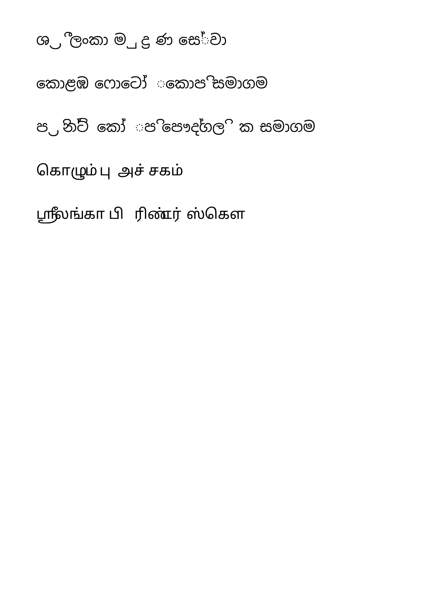
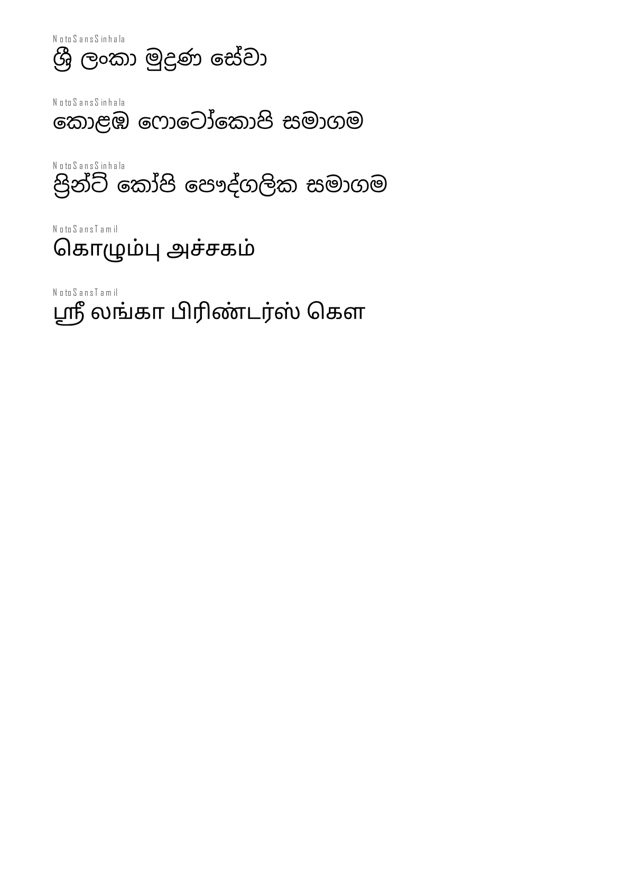

# Spike: Sinhala and Tamil text in invoice PDFs (task 6b, 2026-10-10)

**Outcome:** the client decided RentDesk is English only (decision 33). This note
records what was found, so Sinhala/Tamil can be added later without repeating the work.

## Question

Can invoice PDFs show company and customer names in Sinhala or Tamil correctly with a
server-side library that fits Vercel Hobby (no headless browser)?

## Method

Five sample names (for example ශ්‍රී ලංකා මුද්‍රණ සේවා, කොළඹ ෆොටෝකොපි සමාගම,
கொழும்பு அச்சகம்) were shaped with Noto Sans Sinhala / Noto Sans Tamil by:

1. **pdf-lib + @pdf-lib/fontkit** (pdf-lib's own text layout), and
2. **HarfBuzz** (harfbuzzjs 1.6, WebAssembly; the shaper Chrome, Android and LibreOffice use) as the reference.

The glyph ids and positions were compared, and both PDFs were rendered to PNG with pdf.js.

## Findings

| | pdf-lib + fontkit | HarfBuzz + pdf-lib |
| --- | --- | --- |
| Sinhala | **Broken.** fontkit crashes (`regeneratorRuntime is not defined`); with a polyfill it inserts dotted circles (◌) inside syllables (ෆොටෝ, කෝ), picks the wrong glyph for ශ්‍රී and ignores mark positioning (GPOS) | Correct (identical to HarfBuzz by definition) |
| Tamil | Right glyphs, wrong spacing (kerning ignored) | Correct |

*pdf-lib alone: dotted circles, detached vowel signs, broken spacing.*

*HarfBuzz shaping, glyphs written by pdf-lib: correct conjuncts and vowel order.*

## If Sinhala/Tamil is needed later

- Shape each Sinhala/Tamil run with **harfbuzzjs** (MIT, ~440 KB WASM; the subset WASM is
  another ~670 KB if fonts should be subset).
- Write the shaped glyph ids with explicit positions into a Type0 / CIDFontType2 font
  (Identity-H, CIDToGIDMap Identity) embedded through pdf-lib's low-level API (~150
  lines), with a ToUnicode map or ActualText so the text can be copied.
- Keep Latin text on pdf-lib's normal subset embedding; embed the Sinhala/Tamil font only
  when a name needs it.
- Lift the English-only validation (`src/lib/text/english.ts`) for the fields concerned
  and test: compare the glyph ids in the PDF with HarfBuzz's output and assert no
  dotted-circle glyph.
- Rejected alternatives: @react-pdf/renderer (same fontkit family, same problems), a
  headless browser (too heavy for Vercel Hobby), names drawn as images (blurry, not
  selectable, needs system fonts on the server).
